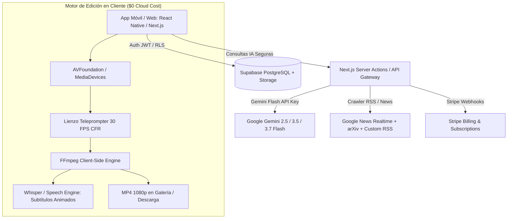

# 🚀 CreatorStudio AI — Documento de Arquitectura & Blueprint de SaaS Comercial

> **Plataforma Autónoma de Inteligencia de Contenido, Generación Multirredes, Studio Teleprompter y Auto-Edición de Video (CapCut Ligero Integrado)**
> 
> *Documento de especificación técnica, arquitectura del sistema, modelo de seguridad, motor de postproducción de video, diseño UX/UI y hoja de ruta de implementación paso a paso.*

---

## 1. 📌 Visión General del Producto

### 1.1 Propuesta de Valor Diferenciadora
A diferencia de los teleprompters convencionales del mercado (que son meros visores de texto pasivos) y de los editores manuales pesados como CapCut (que requieren horas de trabajo manual en la línea de tiempo), **CreatorStudio AI** es un sistema **End-to-End (Todo en Uno)** diseñado para creadores de contenido, marcas, agencias y periodistas. Abarca el ciclo completo de producción en 5 pasos fluidos:

1. **Descubrimiento de Tendencias & Fuentes Propias**: Rastreo autónomo de fuentes globales (Google News, arXiv, RSS y palabras clave personalizadas por cada creador).
2. **Generación del Kit de Producción Multirredes**: Transformación del tema en guiones estructurados, títulos CTR, descripciones SEO, timestamps y prompts de imágenes IA (16:9 y 9:16) adaptados al tono del usuario.
3. **Grabación en Studio Teleprompter**: Grabación nativa sin zoom artificial, con selección de formato (9:16 vertical / 16:9 horizontal), conteo de 5s, modo espejo, pantalla completa universal en iPhone/Android/PC y audio a 48 kHz.
4. **Auto-Edición & Postproducción Inteligente (CapCut Ligero Integrado)**: Subtítulos dinámicos animados (estilo Hormozi/TikTok), corte automático de silencios (*jump-cuts*), inserción de B-Roll (imágenes IA) y música con atenuación (*audio ducking*).
5. **Exportación y Publicación en 1 Clic**: Video final MP4 1080p Full HD listo para publicar en YouTube, Shorts, TikTok, Instagram Reels o LinkedIn.

---

## 2. 🎯 Especificaciones de Funcionalidad & Multi-Redes

### 2.1 Onboarding & Configuración de Temas y Marca (Workspace & Brand Kit)
Cada usuario al registrarse configura su **Workspace Personalizado**:

* **Configuración de Temas & Fuentes Propias (Custom Topics & Feeds)**:
  * **Nichos Predeterminados**: *Tecnología & IA, Finanzas & Cripto, Bienes Raíces, Salud & Longevidad, Fitness, Historia & Gaming, Desarrollo Personal, B2B / SaaS.*
  * **Radar de Palabras Clave**: Palabras o frases clave personalizadas que el usuario desea monitorear en tiempo real (ej. *"Sociedad 5.0"*, *"Microchips neuromórficos"*, *"Tasas de interés FED"*).
  * **Fuentes RSS & Canales Propios**: Posibilidad de ingresar URLs de feeds RSS favoritos, subreddits o portales especializados.
* **Tono de Voz & Estilo Editorial**: *Periodístico / Riguroso, Entusiasta & Dinámico, Educativo / Tutorial, Dramático / Storytelling, Humorístico / Irónico.*
* **Manifiesto o Tesis de Marca**: Directriz ética o filosófica que la IA incorporará en cada guion (ej. *"Transición hacia el bienestar humano y optimismo tecnológico"*).
* **Brand Kit Visual (Kit de Marca)**:
  * Paleta de colores de la marca (color principal para subtítulos destacados).
  * Tipografías preferidas para subtítulos (*Montserrat, The Bold Font, Komika Axis, Inter*).
  * Logotipo o marca de agua (*watermark*) para estampar en las esquinas del video.
* **Redes Sociales Objetivo**:
  * 📺 **YouTube (Largo 16:9)**: Guiones de 10 min, títulos A/B, descripción SEO, marcas de tiempo y prompts 16:9.
  * 📱 **TikTok / Shorts (Vertical 9:16 | 30s-60s)**: Gancho visual/verbal en los primeros 3s, ritmo acelerado, hashtags y bucle final.
  * 📸 **Instagram Reels / Stories (9:16)**: Formato estético, llamados a la interacción en comentarios y copia para *caption*.
  * 💼 **LinkedIn (Video Ejecutivo)**: Enfoque profesional, síntesis en puntos clave (*bullet points*) para el post.

---

### 2.2 Motor de Postproducción Automatizada: "CapCut Ligero Integrado"
El módulo de edición resuelve el 90% del trabajo manual de edición en segundos, ejecutándose directamente en el cliente (0 costo de GPU en la nube):

```text
┌────────────────────────────────────────────────────────────────────────┐
│               PIPELINE DE AUTO-POSTPRODUCCIÓN INTELIGENTE               │
│                                                                        │
│  [Video Crudo] ──► [1. Auto Jump-Cuts] ──► [2. Subtítulos IA]         │
│  Grabado en 4K/1080p   Elimina silencios > 0.4s   Palabra por palabra  │
│                                                          │             │
│  [Video Final MP4] ◄── [4. Audio Ducking & SFX] ◄── [3. Inserción B-Roll]
│  Listo en 1 clic       Música + Efectos sonoros     Imágenes Gemini IA │
└────────────────────────────────────────────────────────────────────────┘
```

1. **Subtítulos Dinámicos Animados (Kinetic Captions estilo Hormozi / TikTok / MrBeast):**
   * Transcripción palabra por palabra con marcas de tiempo precisas (Speech-to-Text).
   * Animación en vivo: la palabra actual que el creador pronuncia se resalta con color brillante (amarillo, verde lima, cyan) y escala ligeramente (1.1x).
   * Inserción automática de emojis contextuales según las palabras clave detectadas (ej. 💰 al decir "dinero", 🚀 al decir "crecimiento", 🧠 al decir "inteligencia").
2. **Corte Inteligente de Silencios (*Smart Silence Trimmer / Auto Jump-Cuts*):**
   * Detección de silencios y pausas mayores a 400ms mediante análisis de amplitud de audio (Voice Activity Detection - VAD).
   * Recorte automático de los espacios muertos, eliminando titubeos y produciendo un ritmo acelerado y viral.
3. **Inserción de B-Roll & Apoyo Visual Automatizado:**
   * Gemini genera las imágenes de apoyo durante la fase de guion.
   * La app monta automáticamente estas imágenes sobre la pista de video principal con transiciones suaves (*zoom-in / fade*) exactamente en los segundos indicados en el guion.
4. **Tratamiento Sonoro Profesional (*Audio Ducking & SFX*):**
   * Selección de música de fondo libre de derechos (Lo-Fi, Cinematográfica, Enérgica, Corporativa).
   * *Audio Ducking*: La música baja a un 15% de volumen mientras el creador habla y sube al 40% en las transiciones.
   * Efectos de sonido (SFX) automáticos en transiciones y ganchos (*whoosh, pop, bell*).
5. **Motor de Renderizado Híbrido ($0 Costo en la Nube):**
   * **Client-Side Rendering**: Renderizado en el propio dispositivo mediante **FFmpeg WebAssembly** (en web) o **FFmpeg-Kit** (en la app móvil React Native / Flutter).
   * **Salida**: MP4 H.264 / AAC estándar a 1080p 30/60 FPS, 100% compatible con todas las redes sociales.

---

## 3. 🏗️ Arquitectura Técnica del Sistema (Stack de Tecnologías)



### 3.1 Tecnologías Recomendadas

| Capa del Sistema | Tecnología Elegida | Justificación Técnica & Costo |
| :--- | :--- | :--- |
| **Frontend / App** | **React Native (Expo)** o **Next.js 14+** | Un solo código base para iOS, Android y Web. Acceso nativo a cámara y pantalla completa. |
| **Backend & Base de Datos** | **Supabase (PostgreSQL Multi-Tenant)** | Autenticación, Row Level Security (RLS) por usuario, Storage de imágenes/videos y PostgreSQL. |
| **Motor de IA & Guiones** | **Google Gemini Flash (3.5 / 3.7)** | El menor costo del mercado (~$0.001 por guion completo) con respuestas ultra-rápidas en Structured JSON. |
| **Rastreador de Tendencias** | **Google News RSS + Parser XML** | Búsqueda ilimitada en tiempo real de cualquier nicho a costo **$0 USD**. |
| **Transcripción de Audio** | **Whisper Local / Native Speech Engine** | Transcripción palabra por palabra en el procesador del dispositivo a costo **$0 USD**. |
| **Motor de Edición & Render** | **FFmpeg-Kit (Móvil) / FFmpeg Wasm (Web)** | Recorte de silencios, quema de subtítulos y mezcla de audio directo en el cliente (**$0 costo de servidor**). |
| **Pasarela de Pagos** | **Stripe / RevenueCat (In-App Purchases)** | Cobros recurrentes mensuales para SaaS web y suscripciones en App Store / Play Store. |

---

## 4. 🔒 Modelo de Seguridad & Aislamiento Multi-Tenant

### 4.1 Aislamiento de Datos por Usuario (Row Level Security - RLS)
En Supabase (PostgreSQL), cada tabla (`workspaces`, `temas_rss`, `scripts_history`, `videos_generados`) está estrictamente aislada por el `user_id` del usuario autenticado:
```sql
-- Política RLS: Los usuarios solo pueden ver y editar sus propios guiones y configuraciones
CREATE POLICY "Acceso Aislado por Creador" 
ON creator_workspaces 
FOR ALL 
USING (auth.uid() = user_id);
```

### 4.2 Protección de API Keys
* La llave de Gemini API **nunca se expone al cliente**. Se resguarda en el backend y solo se procesa tras validar el token de sesión del usuario y verificar que su suscripción esté activa y con saldo de créditos disponible.

---

## 5. 💰 Modelo de Negocio & Tiers de Monetización (SaaS Pricing)

| Plan | Precio | Límites de IA | Motor de Edición (CapCut Ligero) |
| :--- | :--- | :--- | :--- |
| **Free (Prueba)** | $0 / mes | 3 guiones / mes | Marca de agua de CreatorStudio AI, videos de máx 60s. |
| **Creator Pro** | **$19 USD / mes** | 50 guiones / mes, todos los nichos | Sin marca de agua, subtítulos animados ilimitados, B-Roll IA, 1080p 60fps. |
| **Agency / Studio** | **$49 USD / mes** | Guiones ilimitados, multi-workspace | Todo lo de Pro + exportación en 4K, kit de marca ilimitado y soporte prioritario. |

> **Economía Unitaria (Unit Economics):** Costo de servidor e IA por usuario activo en Plan Pro: **~$0.35 USD/mes**. Margen de ganancia bruta: **>95%**.

---

## 6. 🛣️ Hoja de Ruta de Implementación (Paso a Paso)

### Fase 1: Base del Sistema & Autenticación Multi-Tenant (Semana 1)
- [ ] Crear repositorio `creator_studio_saas`.
- [ ] Configurar Supabase con Auth (Google / Apple / Email) y tablas multi-tenant (`workspaces`, `topics`, `scripts`).
- [ ] Desarrollar la pantalla de Onboarding (selección de nicho, tono y configuración de fuentes RSS/Google News).

### Fase 2: Radar de Tendencias & Pipeline de Guiones Multi-Redes (Semana 2)
- [ ] Migrar el motor de ingesta inteligente con soporte para palabras clave personalizadas por usuario.
- [ ] Integrar Gemini Flash con esquemas Pydantic / TypeScript para YouTube, Shorts, TikTok y LinkedIn.
- [ ] Generación automática de prompts de imágenes B-Roll en formato 16:9 y 9:16.

### Fase 3: Studio Teleprompter Multiplataforma (Semana 3)
- [ ] Integrar el motor Canvas CFR a 30 FPS con selector de formato (9:16 vertical / 16:9 horizontal).
- [ ] Ajuste de encuadre natural (0 zoom artificial) y atajos de teclado / controles táctiles.
- [ ] Indicadores numéricos dinámicos de velocidad (`4x`) y tamaño de texto (`30px`).

### Fase 4: Motor de Auto-Edición "CapCut Ligero" (Semana 4)
- [ ] Integrar motor de Speech-to-Text para generación de subtítulos dinámicos palabra por palabra con estilos personalizables.
- [ ] Implementar el detector y cortador automático de silencios (VAD Jump-Cuts).
- [ ] Ensamblaje de imágenes de apoyo (B-Roll) sobre la línea de tiempo.
- [ ] Renderizado y exportación local con FFmpeg.

### Fase 5: Monetización (Stripe / In-App Purchases) & Lanzamiento Comercial (Semana 5)
- [ ] Integrar pasarela de cobro recurrente con Stripe y portal de suscripción.
- [ ] Control de límites de créditos y planes en Supabase RLS.
- [ ] Landing page comercial con demostración en video y panel de testimonios.
- [ ] Despliegue en producción.

---

> **Status**: *Blueprint actualizado v2.0 — Listo como guía maestra de producto, ingeniería y negocio.*
